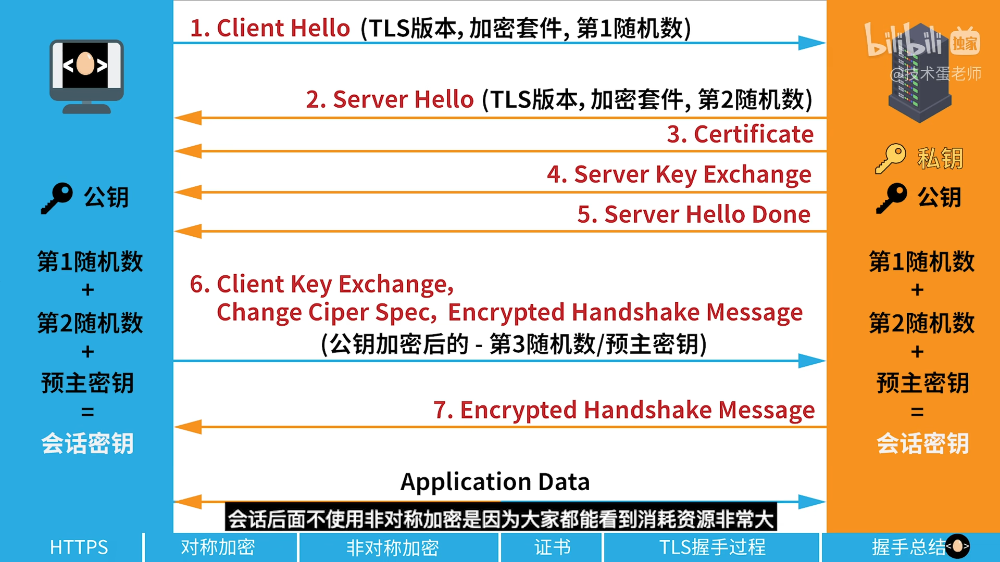

# 业务问题

## Q：消费者场景为什么要做幂等？

A：

1. 当使用消息队列时，消息队列只能保证at-least-once，因此可能出现重复投递的消息
2. 网络延迟可能导致丢包、重试等事件，因此可能会出现重复请求多次发送的问题。

## Q：如何实现幂等

A：

1. 使用唯一的订单id作为标识，并利用redis的set进行去重，如果已经存在了，则不进行处理
2. 使用状态机进行处理，每次收到请求都要包含状态信息
3. 设置唯一约束，数据库中设置唯一约束，在出现重复请求时，进行插入会导致错误

## Q：秒杀如何防止超卖

A：

超卖是指因为并发等问题，扣减了超出存量数据的问题。超卖可以使用redis预扣减方案进行解决。redis的请求处理是单线程的，且DECR是原子操作，当发现DECR为负数时，停止请求，并回滚扣除。

## Q：Redis的hot key问题是什么？如何防止

A：

hot key是指在短时间内大量请求redis某个特定的key，redis无法处理这些请求而导致宕机。

hot key问题可以通过以下的方式防止

1. 通过一致性哈希或者内置的hash函数保证请求的均匀分布
2. nginx或者其他的代理工具将请求分发到不同的节点

## Q：项目中的缓存和数据库是一个高度要求一致性的场景吗？

A：

缓存和数据库不是一个高度要求一致性的场景，一般来说满足最终一致性即可。

## Q：redis在大量流量面前宕机如何处理？

A：

1. 启用redis的持久化机制（RDB，AOF），即使redis宕机数据也可以恢复
2. 建立redis集群，并将请求分布到集群中，避免单个redis接收过多的流量
3. 使用MQ削峰填谷

## Q：一张表，三列数据：学生姓名、科目、成绩每个学生可能选择多个科目，且数量不固定，要求返回所有科目成绩大于80分的学生姓名

A:

```sql
SELECT name
FROM table
GROUP BY name
HAVING MIN(score) > 80;
```

## Q: 多线程开发如何避免死锁

A：

1. 使用一定的获取锁和解除锁的顺序
2. 能够在不使用锁的时候不要使用锁
3. 设置锁的过期时间，允许锁可以自动解锁
4. 使用tryLock等方法，设置等待时间
5. 减小锁的范围，不要过大
6. 设置死锁检测机制，能够发现死锁并处理

## Q：缓存扣减成功订单一定会成功吗？

A：

缓存扣减成功并不一定意味着订单一定成功。在秒杀系统中，Redis 预扣减库存只是第一步，用于削峰限流。后续还需要通过消息队列创建订单并在数据库中真正扣减库存。在这个过程中可能出现数据库扣减失败、订单服务异常、消息队列消费失败等情况，因此订单可能最终失败。通常系统会通过库存回补机制、消息补偿和定时对账等方式保证最终一致性。

## Q：缓存和真实的库存是一样的吗？有没有冗余

A：

在高并发系统中，缓存库存和数据库真实库存通常不是强一致的，而是最终一致。Redis主要用于高并发场景下的库存预扣减，数据库负责最终的库存扣减和订单持久化。由于在消息传递和订单处理过程中可能存在延迟或失败，因此系统一般会设计安全库存或冗余库存，例如数据库库存100但Redis只放95，以避免超卖。同时还会通过库存回补和定期对账机制保证最终一致性。

## Q: 为什么MySQL使用B+树而不是B树呢？

A：

B树的结构是每个节点都会携带一定的数据，而B+树的结构是只有叶子节点携带数据，中间节点只是范围索引。MySQL存储文件的大小是一定的，使用B+树可以在一个文件中存放更多的节点，减少树的高度，从而减少磁盘IO。另外，B+树只有在叶子节点存在数据，查询的稳定性要强与B树。最后，B+树更加适合范围查询，因为B+树的叶子节点使用双向链表连接。

## Q：MySQL怎么创建联合索引？

A：

```sql
CREATE INDEX idx_col1_col2_coln ON tab(col1, col2, coln);

ALTER TABLE tab ADD INDEX idx_col1_col2_coln (col1, col2, coln);
```

## Q：MySQL联合索引怎么匹配？

MySQL联合索引使用的是最左前缀匹配，首先匹配第一个字段，然后逐次匹配后方的字段。

是否能够使用索引也是通过最左前缀匹配方式实现的。

## Q：TCP和UDP的区别

A：

TCP和UDP都是传输层协议。为应用层提供端到端的数据传输。

TCP是面向连接的传输协议，提供可靠、顺序传输，具有拥塞控制，流量控制等特点，适合于文件传输等需要可靠传输的应用场景。

UDP是面向无连接的传输协议，不能保证传输的可靠和有序，但传输速度快，开销小，适合于实时通信或者广播等场景。

## Q：TCP如何确保可靠传输

A：

TCP保证可靠传输主要依靠几点：

1. 消息确认和重传
	- TCP为每个报文提供了序列号，发送方在发送TCP报文后会等待ACK。
	- 一段时间没有收到ACK请求，发送方会重新发送。
	- 网络丢包时可以保证数据可以到达。
2. 顺序控制
	- 每个段带有序列号
	- 接收方根据序列号重新排序
	- 接收方可通知发送方缺失段，实现选择重传
3. 流量控制
  - 防止因为发送方发送速度过快，而导致接收方来不及处理
  - 接收窗口机制，当返回ACK包时，会携带本地窗口大小，发送方需要根据窗口大小发送数据长度
4. 拥塞控制
	- 慢开始：一开始从1开始以2的指数到达拥塞窗口大小
	- 拥塞避免：后续以线性方式增长发送的数据大小
	- 快重传：当遇到连续三个重传信号后，重新发送缺失的数据包
	- 快恢复：拥塞窗口变为一半，重新进入拥塞避免阶段

## Q: RabbitMQ和Kafka的区别？

A：

1. RabbitMQ基于AMQP协议实现，Kafka是基于TCP的自定义协议。
2. RabbitMQ的结构是：producer -> exchange -> queue -> consumer，kafka的结构是 producer -> topic -> partition -> consumer
3. RabbitMQ的消息在接受到ACK后就会删除，Kafka的数据是写入在日志文件中的，即使被消费也会保留
4. RabbitMQ的性能和吞吐量要低于Kafka

## Q: jwt具体有哪几个组成部分

A：

JWT分为 header, payload，signature三部分，其中header存储了消息的元数据，一般是token类型和加密信息，payload是用户自定义信息，signature则是根据header中的算法对前面两部分进行加密后得到的签名信息。

JWT中每个部分都会使用Base64进行编码，然后使用`.`做分割，因此是a.b.c的格式

## Q：JWT的作用？

A：

JWT主要用于在不同系统之间安全的传递用户身份信息，实现无状态认证。使用JWT，验证信息会被保存在客户端而不是服务器，减轻了服务器的负担。当用户发送JWT的token后，服务器会验证是否有效，如果有效则认为可以执行某些任务。

## Q：JWT的缺点

A：

1. 无法主动过期，必须等待过期时间才可以失效。（可以使用JWT-Redis双Token机制）
2. 数据使用Base64编码，不能存放敏感信息
3. Token的体积较大

## Q：ES是什么？

A：

ES是elastic search的缩写，是一个分布式全文搜索数据库，底层基于lucene。ES基于倒排索引和BM25算法实现数据的快速检索。

BM25算法：1. 考虑词频，词出现次数越多，权重越高；2.逆文档频率：一个词在多个文档中出现的次数越多，权重越低；3.文档长度：词频需要进行归一化，防止因为文档长度很长导致词频变多。

## Q：为什么ES适合做日志数据库？

A：

1. ES是全文搜索数据库，使用倒牌索引可以很快找到对应的数据项，如果使用关系型数据库，很容易导致索引不命中，从而全表查询。
2. ES支持分布式存储，可以处理TB级别的数据
3. ELK生态非常完善，适合处理日志信息

## Q：为什么ES是NRT（接近实时）系统？

A：

ES底层使用的是lucene，lucene使用segment作为查询单元。

当写入数据时，会先将其从内存写入到tranlog，防止数据丢失。ES会每隔一段时间（例如1s）执行fresh操作，这个操作会生成segment。此时才可以搜索，segment是只读的，如果直接指向fresh操作，会导致segment碎片过多，影响查询性能。

## Q：HTTP和HTTPS的区别是什么？

A：

HTTP 和 HTTPS 的主要区别是 HTTPS 在 HTTP 基础上增加了 TLS/SSL 加密层。

1. HTTP 是明文传输，而 HTTPS 会对数据进行加密，并通过数字证书验证服务器身份，从而保证数据的机密性、完整性和身份认证。
2. HTTP 默认端口是 80，而 HTTPS 默认端口是 443。

## Q：TLS握手过程是什么？

A：

参考下图:



