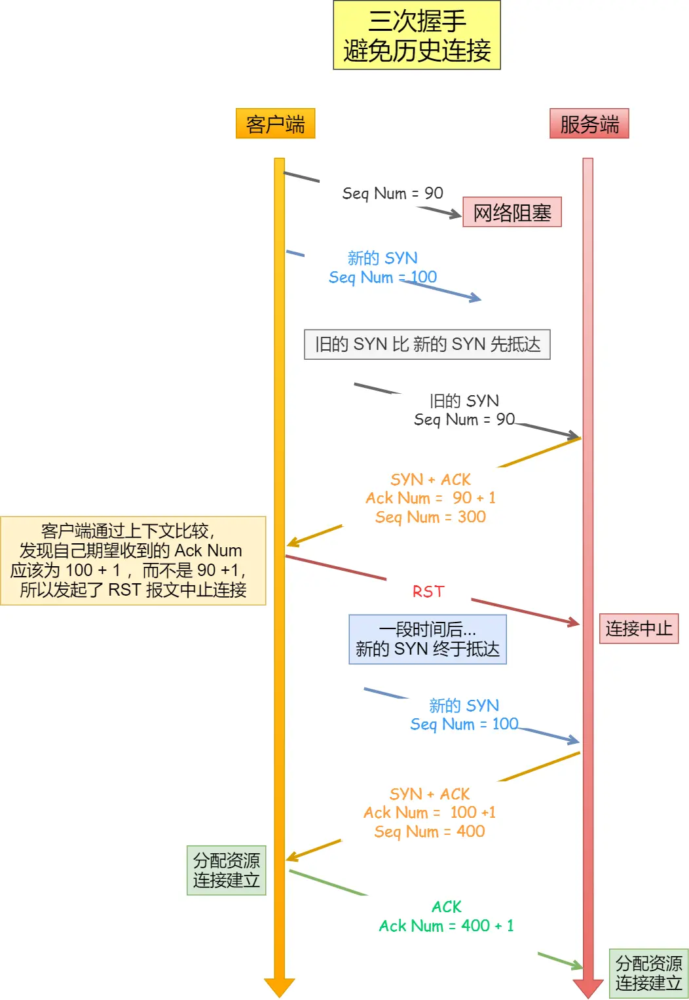

# TCP

## Q：七层/五层/四层模型是什么？

A：

七层模型（ISO）：

| 层名       | 描述                     |
| ---------- | ------------------------ |
| 应用层     | 为用户提供网络服务       |
| 表示层     | 数据处理                 |
| 会话层     | 针对会话进行处理         |
| 传输层     | 提供端到端服务           |
| 网络层     | 负责数据包的跨网络传输   |
| 数据链路层 | 相邻节点直接提供可靠传输 |
| 物理层     | 处理物理信号             |

五层模型：

| 层名       | 描述                 |
| ---------- | -------------------- |
| 应用层     | 为用户提供网络服务   |
| 传输层     | 提供端到端的网络服务 |
| 网络层     | 负责数据包的传输     |
| 数据链路层 |                      |
| 物理层     |                      |

四层模型（TCP/IP）：

| 层名       | 描述                                           | 常见协议      | 数据单元      |
| ---------- | ---------------------------------------------- | ------------- | ------------- |
| 应用层     | 提供用户直接使用的网络服务接口 应用<->应用     | HTTP，SSH,DNS | 数据data      |
| 传输层     | 应用层将数据包传给传输层，进程<->进程          | TCP，UDP      | 报文段/数据报 |
| 网络层     | 负责数据包的路由选择、寻址、转发               | IP、ARP、NAT  | 数据包packet  |
| 网络接口层 | 负责物理传输、帧封装、MAC 地址寻址、错误检测等 | 以太网，wifi  | 帧frame       |

## Q：TCP的三次握手

A：

1. 客户端发送SYN包（SYN=1, seq=x）
2. 服务端返回SYN-ACK包（SYN=1,ACK=1,seq=y,ack=x+1）
3. 客户端回复ACK包（ACK=1,seq=x+1,ack=y）

## Q：为什么TCP是三次握手而不是两次或者四次

A：

为什么不是两次：

1. 两次连接会导致重复历史连接的初始化。如果两次连接容易产生历史连接的初始化问题。两次握手，服务端没有中间状态阻止历史连接。导致服务端可能会产生历史连接问题浪费资源。
2. 同步双方序列号：确保后续双方通信的一致。
3. 防止客户端的攻击：发送若干连接，导致服务端资源浪费。

为什么不是四次：三次即可无需第四次。

## Q：TCP三次握手丢失会怎么样？

A：

1. 第一次握手丢失：服务端没有接收到客户端的的请求，客户端会在超时后重新发送请求。如果一直超时，则会停止建立连接。
2. 第二次握手丢失：服务端接收到了客户端的请求会向客户端发送SYN-ACK请求，客户端在一段时间后未收到SYN-ACK，会重新发送请求，服务端在接收到客户端的请求后，会重新发送SYN-ACK请求。服务端也会向客户端发送请求。如果服务端超时，服务端会释放连接。
3. 第三次握手丢失：服务端会重复发送SYN-ACK请求，客户端收到这个请求后会重传SYN-ACK请求。

## Q：TCP三次握手服务端的状态变化

A：请求 -> SYN队列 (发送SYN-ACK)->收到(ACK) -> Accept队列 -> accept() 

## Q：TCP的四次挥手

A：

1. 一方发送FIN=1包给对方
2. 对方发送ACK包回应
3. 一段时间后对方发送FIN包
4. 对方回应ACK包断开连接

几个时间：

- FIN_WAIT_1: 请求方发出FIN包后等待ACK包的时间
- FIN_WAIT_2: 请求方收到对方的ACK到收到对方的FIN包的时间
- TIME_WAIT: 请求方收到对方的FIN到收到对方的ACK包的时间，一般为2MSL
- CLOSE_WAIT: 被请求方收到FIN到自己发送ACK之间的时间
- LAST_ACK：被请求方发送FIN到收到ACK之间的时间

## Q：为什么要四次挥手？

A：

1. 关闭连接时，发送方发送FIN只是不发送数据了，而不是不接收数据，还可以接收被请求方的数据。
2. 当被请求方准备停止服务才可以真正停止

## Q：四次挥手丢失了会怎么样？

A：

1. 第一次挥手丢失：请求方会返回发送FIN,直到次数用尽，关闭连接。
2. 第二次挥手丢失：请求方会认为自己是第一次挥手丢失进行重试。被请求方认为在接收到FIN包后会重发响应。
3. 第三次挥手丢失：被请求方会重试，直到次数用尽。请求方也会因为长时间FIN_WAIT_2而关闭
4. 第四次挥手丢失：被请求方会重试，当请求方收到后会回复ACK。

## Q：TIME_WAIT的作用是什么？

A：

1. 确保最后一次ACK能到达对端
2. 防止旧连接延迟包影响新连接
3. 让TCP的序列号更安全

## Q：如何缓解TIME_WAIT过多的问题？

A：

1. 增加可用端口数量
2. 允许端口被新连接安全重用
3. 使用长连接，实现复用

## Q：服务器出现大量TIME_WAIT的原因是什么？

A：

1. HTTP请求没有使用长连接
2. 服务器Keep-Alive时间过短超时
3. 对某些中间件的连接为短连接

